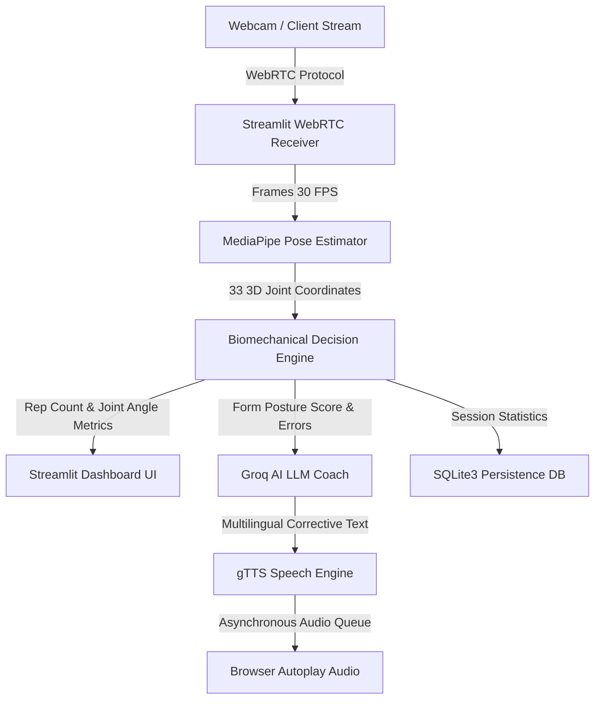

# 🏋️‍♂️ AI Real-Time Gym Coach

[](https://www.python.org/)
[](https://streamlit.io/)
[](https://google.github.io/mediapipe/)
[](https://groq.com/)
[](https://www.sqlite.org/)

An ultra-premium, real-time AI-powered personal gym coach application. This project showcases advanced **Computer Vision**, **Biomechanical Mathematics**, and **Asynchronous AI Pipelines** to monitor exercise form, count repetitions, and deliver instant corrective voice feedback in multiple languages.

## 🌐 Live Demo

Experience the project live:
* **🚀 Deployed Streamlit Web App (AI Coach):** [https://ai-gym-coach-fgsctzk7pvnsrypw8qzrev.streamlit.app/](https://ai-gym-coach-fgsctzk7pvnsrypw8qzrev.streamlit.app/)
* **✨ Live Landing Page:** [https://nikhil3235.github.io/ai-gym-coach/](https://nikhil3235.github.io/ai-gym-coach/)

---

## 🛠️ Developer Skills Showcased

* **Real-time Edge Computing:** Building ultra-low latency vision pipelines utilizing Google MediaPipe and OpenCV.
* **Biomechanical Modeling:** Calculating 3D vector joint angles (vector dot products, trigonometric posture scoring).
* **Asynchronous AI Orchestration:** Integrating Groq LLaMA-3 APIs with Google Text-to-Speech (gTTS) for real-time multilingual coaching queues.
* **Full-Stack Systems:** Creating responsive glassmorphism web UIs (HTML5/CSS3/JS) and robust local databases (SQLite3).

---

## ⚡ Biomechanical Mechanics & Math

The application tracks **33 skeleton coordinates** at 30 FPS. Posture and repetition counting are computed using 3D coordinate geometry:

$$\theta = \arccos \left( \frac{\vec{u} \cdot \vec{v}}{\|\vec{u}\| \|\vec{v}\|} \right)$$

| Exercise | Primary Joint Tracked | Mathematical Angle Formula | Form Quality Criteria |
| :--- | :--- | :--- | :--- |
| **Squats** | Knee (Hip-Knee-Ankle) | $\arccos$ of vectors (11-13) and (13-15) | Depth $\le 90^\circ$, Back Angle $\ge 75^\circ$ |
| **Push-ups** | Elbow (Shoulder-Elbow-Wrist) | $\arccos$ of vectors (11-12) and (12-14) | Bottom $\le 90^\circ$, Hip-Shoulder alignment |
| **Bicep Curls** | Elbow (Shoulder-Elbow-Wrist) | $\arccos$ of vectors (11-13) and (13-15) | Full extension ($160^\circ$) to contraction ($35^\circ$) |
| **Shoulder Press**| Shoulder & Elbow | $\arccos$ of vectors (12-14) and (14-16) | Full arm extension ($170^\circ$), arch detection |
| **Lunges** | Front Knee & Torso | $\arccos$ of vectors (23-25) and (25-27) | Step depth ($90^\circ$), perpendicular torso angle |

---

## ⚙️ System Architecture



---

## 🚀 Key Features

### 🌐 Premium Landing Page (`LandingPage/`)
* **3D Tilt Visuals:** Glassmorphic interactive cards with responsive 3D cursor-tracking tilt effects.
* **Particle Canvas:** Floating background particles rendered in real-time via HTML5 Canvas.
* **Secure Web Demo Video:** Highly optimized H.264 video player featuring disabled right-clicks and downloads for privacy protection.
* **Reveal Animations:** Staggered scroll animations for a premium tech-startup user experience.

### 🏋️‍♂️ Streamlit Web Application (`main_app/`)
* **👤 User Authentication:** Secure register/login wall storing hashed user credentials in SQLite3.
* **🌐 Multilingual Voice Coach:** Real-time speech instructions in **English, Hindi, or Marathi**.
* **🔢 Automatic Rep & Set Counter:** Real-time state machines detecting complete repetitions.
* **📊 Workout History Dashboard:** Visualizes daily workout logs, reps, sets, and average form quality score.

---

## 📁 Project Structure
```text
ai-gym-coach/
├── index.html                   # Root redirect to Landing Page
├── README.md                    # Project documentation (This file)
├── LandingPage/                 # Landing Page directory
│   ├── index.html               # Main landing page markup
│   ├── style.css                # Premium custom stylesheet
│   ├── script.js                # Particle systems & tilt effects
│   └── videos_add_your_own/     # Compressed browser-compatible demo video
└── main_app/                    # Streamlit Web Application
    ├── main.py                  # Streamlit main entry point
    ├── requirements.txt         # App python dependencies
    ├── core/                    # Base exercise models and structure
    ├── detectors/               # Exercise-specific angle processors
    ├── services/                # Business logic services
    │   ├── auth/                # Login and user verification
    │   ├── persistence/         # SQLite DB repository operations
    │   ├── coaching/            # LLM prompt, TTS generation & voice pipeline
    │   └── vision/              # WebRTC video frame processor
    └── static/                  # Streamlit custom font and styles
```

---

## ⚙️ Installation & Local Setup

### 1. Clone the Repository
```bash
git clone https://github.com/Nikhil3235/ai-gym-coach.git
cd ai-gym-coach
```

### 2. Run the Landing Page
Open the `index.html` file in any web browser to view the premium landing page locally.

### 3. Run the Streamlit Application
Navigate into the `main_app` directory:
```bash
cd main_app
```

#### Windows Setup:
```bash
python -m venv venv
venv\Scripts\activate
pip install -r requirements.txt
streamlit run main.py
```

#### macOS/Linux Setup:
```bash
python3 -m venv venv
source venv/bin/activate
pip install -r requirements.txt
streamlit run main.py
```

### 4. Configure Secrets
Create a `.env` file in the `main_app` folder:
```env
GROQ_API_KEY="your_groq_api_key_here"
```

---

## 📝 Database Schema (SQLite)

### `users` Table
* `id` (INTEGER, Primary Key)
* `username` (TEXT, Unique)
* `created_at` (TIMESTAMP)

### `exercises` Table
* `id` (INTEGER, Primary Key)
* `user_id` (INTEGER, References `users(id)`)
* `exercise_name` (TEXT)
* `reps` (INTEGER)
* `sets` (INTEGER)
* `time` (INTEGER) - Duration in seconds
* `form_score` (INTEGER) - Quality score (0 to 100%)
* `created_at` (TIMESTAMP)

---

## 📄 License
This project is for educational and portfolio demonstration purposes.

Developed with ❤️ by [Nikhil Mali](https://github.com/Nikhil3235) for fitness enthusiasts